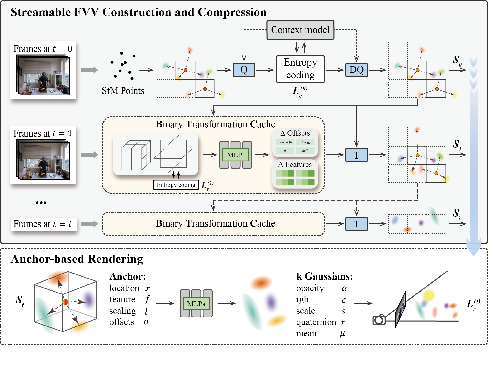

# [AAAI'25] iFVC: Compressing Streamable Free-Viewpoint Videos to 0.1 MB per Frame
[Luyang Tang](https://github.com/Pomelomm/), Jiayu Yang, [Rui Peng](https://prstrive.github.io/), Yongqi Zhai, Shihe Shen, Ronggang Wang

[[`Paper`](https://ojs.aaai.org/index.php/AAAI/article/view/32780)] [[`Github`](https://github.com/Pomelomm/iFVC)]


## Overview
<p align="left">

</p>

iFVC is a Gaussian-based end-to-end compression framework for efficient free-viewpoint video streaming. We propose a highly compact Binary Transformation Cache (BTC) to model scene changes between adjacent timesteps. Our BTC is carefully designed as a saliency-assisted transformation tri-plane, capable of capturing accurate dynamic changes to improve reconstruction quality. Extensive experiments demonstrate the superiority of iFVC in synthesis quality and model size, while also supporting on-the-fly training and real-time rendering.


## Installation

We tested our code on a server with Ubuntu 20.04.6, cuda 11.6, gcc 9.4.0
1. Unzip files
```
cd submodules
unzip diff-gaussian-rasterization.zip
unzip gridencoder.zip
unzip simple-knn.zip
cd ..
```
2. Install environment
```
conda env create --file environment.yml
conda activate iFVC
```

## Data
1.Download the multi-view video datasets:

**N3DV**: 
https://github.com/facebookresearch/Neural_3D_Video

**Meet Room**:
https://github.com/AlgoHunt/StreamRF

**VRU Basketball Game**:
https://huggingface.co/datasets/BestWJH/VRU_Basketball

2.Follow the instructions in [3DGStream](https://github.com/SJoJoK/3DGStream) to prepare the multi-view video dataset, which will end-up like:
```
<scene>
|---frame000000
|   |---sparse
|   |---images
|       |---<image 0>
|       |---<image 1>
|       |---...
|   |---distorted
|    	  |---sparse
|           |---0
|           |---cameras.bin
|           |---images.bin
|           |---points3D.bin
|   |---sparse
|       |---0
|           |---cameras.bin
|           |---images.bin
|           |---points3D.bin
|---frame000001
|   |---sparse
|   |---images
|       |---<undistorted image 0>
|       |---<undistorted image 1>
|       |---....
|   |---<image 0>
|   |---<image 1>
|   |---...
|---frame000002  
|---...
|---frame000299
```
3.You can run
```
python train_videos.py --config_path ./configs/{dataset}/{scene}/{scene}_{lmbda}_{P_lmbda}.json
```
**{scene}\_{lmbda}_{P_lmbda}.json** is a configuration file containing all necessary parameters of a scene:
  - **scene**: scene name, like `coffee_marti`
  - **base_source_path**: path to N3DV/MeetRoom/VRU/ dataset
  - **base_model_path**: model path for all scenes in the dataset
  - **lmbda**: $\lambda_0$ of timestep 0
  - **P_lmbda**: $\lambda_t$ = $\lambda_0 * $ **P_lmbda** (t>0)
  - **Init_frame_params**: parameters of timestep 0 
  - **P_frame_params**: parameters of timestep t (t>0)

The code will automatically run the entire process of: **training, encoding, decoding, testing** for each frame.
 - Training log of each frame will be recorded in `{frame_id}/output.log` of the output directory. Results of **detailed fidelity, detailed size, detailed time** will all be recorded
 - Encoded bitstreams will be stored in `{frame_id}/bitstreams` of the output directory.
 - Decoded model of each frame will be stored in `{frame_id}/point_cloud/iteration_{iter}` of the output directory.
 - Evaluated output images will be saved in `{frame_id}/ours_{iter}/renders` of the output directory.
 - **After training, you can refer to `{frame_id}/bitstreams` to get the final model size of each frame.**

4.You can run
```
python eval_frames.py -m --path base_model_path/scene/
```
to caculate the average metrics of the scene.

4.Initial model at timestep 0 for each scene is available from [here](https://drive.google.com/drive/folders/1Ohhr7MXgX7Zqlr5JvowNGSZX9Ki5zTHz?usp=sharing). You can `unzip` them and start training from timestep 1:
```
unzip outputs_N3DV.zip -d path/to/iFVC
unzip outputs_MeetRoom.zip -d path/to/iFVC
unzip outputs_VRU.zip -d path/to/iFVC
```

## Contact
If you have any questions, please feel free to contact me via `tly2640159930@163.com`.

## Citation

If you find our work helpful, please consider citing:

```bibtex
@inproceedings{tang2025compressing,
  title={Compressing Streamable Free-Viewpoint Videos to 0.1 MB per Frame},
  author={Tang, Luyang and Yang, Jiayu and Peng, Rui and Zhai, Yongqi and Shen, Shihe and Wang, Ronggang},
  booktitle={Proceedings of the AAAI Conference on Artificial Intelligence},
  volume={39},
  number={7},
  pages={7257--7265},
  year={2025}
}
```

## LICENSE

Please follow the LICENSE of [3D-GS](https://github.com/graphdeco-inria/gaussian-splatting).

## Acknowledgement

 - We thank all authors from [3D-GS](https://github.com/graphdeco-inria/gaussian-splatting),[Scaffold-GS](https://github.com/city-super/Scaffold-GS), [3DGStream](https://github.com/SJoJoK/3DGStream), [HAC](https://github.com/https://github.com/YihangChen-ee/HAC) and [BiRF](https://github.com/SAITPublic/BiRF) for presenting such an excellent work.
